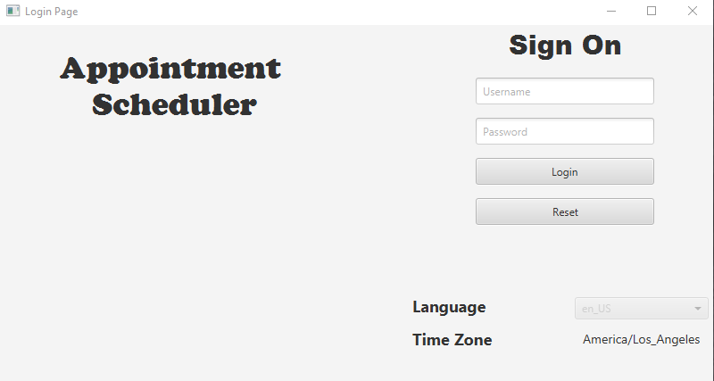
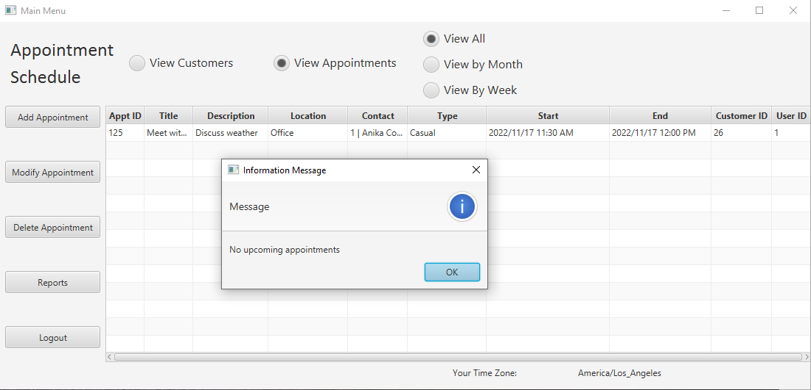
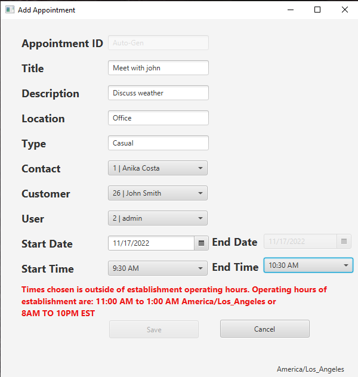

# SchedulingSystemApp
 

<h2>Description</h2>
A fully functional scheduling system with login authorization, time zone, internationalization, localization, and JDBC to MySQL database.

<h2>Languages and Framework</h2>
<li>Java 11.0.16</li>
<li>SQL</li>
<li>JavaFX 18.0.2</li>

<h2>Environments Used</h2>
<li>IntelliJ IDEA 2021.1.3</li>
<li>MySQL Workbench 8.0.30</li>
<li>Windows 10</li>

<h2>Application Screenshots</h2>

Login Page | User: admin | Pass: admin

Login Alerts

Appointment Timezone Protection

